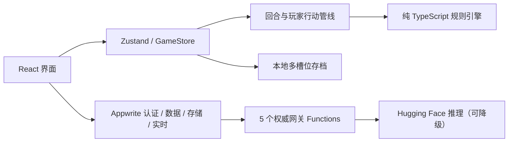

# Imperium Aeternum

<p align="center">
  <strong>治理国家，而不只是征服地图。</strong><br>
  一款围绕财政、民生、权力、外交与长期稳定展开的历史大策略模拟游戏。
</p>

<p align="center">
  <a href="https://lunora-gather.github.io/Imperium-Aeternum/"><strong>在线游玩</strong></a>
  ·
  <a href="#第一次玩">新手上手</a>
  ·
  <a href="#开发与验证">本地开发</a>
  ·
  <a href="docs/README.md">文档中心</a>
</p>

<p align="center">
  
  
  
  
</p>

支持简体中文、繁體中文和 English。游客可以完整游玩单机模式；登录后可使用私有云存档、共享活版图、好友与实时聊天。

## 第一次玩

选择推荐剧本“地中海黎明”，记住这个循环就能开始：

| 1 · 看总览 | 2 · 做一件事 | 3 · 存档并推进 |
| --- | --- | --- |
| 先读“行动中心”，红色风险必须处理 | 只解决今年最重要的问题，不必点遍所有页面 | 保存后结束本年，再用年报决定下一步 |

游戏内还有两层互不重复的帮助：

- `?` 新手帮助：用 6 张短说明讲清完整循环。
- 首局实战引导：带你实际查看经济、省份，完成存档、推进和年报复盘。

## 核心体验

- **长期治理**：财政、粮食、人口、安定、合法性、腐败和地方不满相互影响。
- **有依据的决策**：行动中心、回合前检查、战争预演和顾问建议解释“现在为什么要做”。
- **单机国家使命**：依据国家性格分配治世、通商、扩张、文明或协和路线；三章目标提供明确奖励与重开差异。
- **单机危机链**：财政、法统、地方与长期战争危机会预警、升级并产生后果，连续恢复后也能正式化解。
- **有记忆的外交**：使节、贸易、同盟、联姻、间谍、战争与议和都会留下可衰减的善意或旧怨，实际影响 AI 判断。
- **多条胜利路线**：经营、扩张、外交与长治久安都能成为有效终局目标。
- **可复盘的历史**：年度报告和帝国史册记录使命成果、危机、战争与继承。
- **可靠存档**：多槽位本地存档、旧档迁移、损坏检测，以及登录后的 5 个私有云槽位。
- **共享世界**：玩家控制部分国家，其余国家由 AI 统一推进；服务端负责控制权、行动校验和版本化快照。
- **安全社交**：可直接发现并申请玩家、查看个人名片，也保留好友码；游戏内悬浮消息入口、版图频道、好友私聊和图片消息均经过服务端权限与限流。
- **可控 AI**：Hugging Face 只负责把规则引擎已计算的外交事实整理成简报；失败时自动回退到本地建议，不参与结算。

## 技术架构



浏览器只持有公开的 Appwrite 项目标识。API Key 和 Hugging Face Token 只存在于 Appwrite Function 环境变量中。

## 项目结构

```text
src/
  components/          可复用界面组件
    account/           账号入口
    shared-world/      共享世界大厅
    social/            好友与聊天
    ui/                基础 UI primitives
  data/                剧本与静态规则数据
  engine/              纯规则引擎与回合结算
  gameplay/            产品规则、顾问、行动管线与新手引导
    actions/           事务化玩家命令
  i18n/                语言状态、词典与生成映射
  screens/             页面级组件
  services/            外部基础设施适配器
  shared-world/        共享世界领域模型
  social/              社交领域模型
  store/               状态、场景与存档
  styles/              全局样式层
  types/               共享 TypeScript 类型

functions/
  account-gateway/       账号验证码与密码恢复
  ai-diplomacy-gateway/  AI 简报、配额和降级
  cloud-save-gateway/    私有云存档校验与原子替换
  shared-world-gateway/  控制租约、命令和统一结算
  social-gateway/        好友、频道、私聊和媒体

appwrite/               Appwrite 资源声明与维护脚本
scripts/                构建、数据导出和稳定性模拟
docs/                   当前文档、发布资料与历史记录
```

目录职责、文件命名和新增模块规则见 [项目结构与命名规范](docs/maintenance/PROJECT-STRUCTURE.md)。

## 开发与验证

要求 Node.js 22。

```bash
npm ci
npm run dev
```

常用命令：

```bash
npm run typecheck          # strict + 未使用代码检查
npm run validate           # 静态游戏数据验证
npm test                   # 完整 Vitest 回归
npm run simulate:stability # 长局稳定性模拟
npm run pages:build        # GitHub Pages 兼容构建
```

合并或发布前只需运行统一门禁：

```bash
VITE_BASE=/Imperium-Aeternum/ npm run rc:check
```

它会依次执行类型检查、数据验证、完整测试、稳定性模拟、生产构建和产物体积预算。

## Appwrite 与 Hugging Face

前端由 GitHub Pages 托管，在线能力由 Appwrite 提供。配置入口：

- [Appwrite 账号、数据库、存储与 Functions](docs/maintenance/APPWRITE_SETUP.md)
- [账号、好友与社交边界](docs/maintenance/AUTH-AND-SOCIAL.md)
- [共享活版图架构](docs/maintenance/SHARED-WORLD.md)
- [Hugging Face 推理与降级策略](docs/maintenance/AI-INFERENCE.md)
- [.env.example](.env.example) 中的浏览器公开变量示例

不要把 API Key、Function Secret 或 Hugging Face Token 写入 `.env.example`、前端源码、提交记录或截图。

## 发布状态

| 项目 | 当前值 |
| --- | --- |
| 在线地址 | [lunora-gather.github.io/Imperium-Aeternum](https://lunora-gather.github.io/Imperium-Aeternum/) |
| 版本 | `1.0.0-preview` |
| 主分支 | `main` |
| 部署 | GitHub Actions → GitHub Pages |
| 线上后端 | Appwrite Cloud |

`main` 的每次发布都必须通过 `npm run rc:check`。当前风险、验收与后续计划统一收录在 [维护文档](docs/maintenance/README.md)，历史阶段报告不作为当前实现依据。
